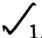

# CamScanner 31-07-2026 10.31.pdf

**Total elements:** 24  

**Tables:** 2  

**Images:** 6  

**Diagrams:** 0  

**Charts detected:** 0  


---

**1. picture**

trar
Re

<!-- grounding: page=1; l=102.6; t=818.8; r=151.2; b=755.9 -->

*Page(s): 1*  

**Media:**  


  


**OCR Text:**
```
trar
Re
```


---

## NED UNIVERSITY OF ENGINEERING & TECHNOLOGY

<!-- grounding: page=1; l=159.0; t=805.0; r=489.0; b=794.3 -->

*Page(s): 1*  


---

## E-Mail:dracad@neduet.edu.pk/Website: www.neduet.edu.pk Phone: (92-21) 99261261-8 Ext-2221/Fax: (92-21) 99261255

<!-- grounding: page=1; l=160.3; t=793.3; r=493.0; b=769.7 -->

*Page(s): 1*  


---

**4. text**

No.Acad/9(H)/53083

<!-- grounding: page=1; l=370.7; t=761.7; r=470.7; b=750.7 -->

*Page(s): 1*  


---

**5. text**

Dated:14-07-2026

<!-- grounding: page=1; l=371.3; t=750.3; r=455.0; b=741.0 -->

*Page(s): 1*  


---

## OFFICE ORDER

<!-- grounding: page=1; l=251.7; t=717.3; r=344.0; b=701.3 -->

*Page(s): 1*  


---

**7. text**

(Artificial Intelligence) to the following students of BS Computer Science Programme BAat    o o  Ssd s o o S-6..

<!-- grounding: page=1; l=88.7; t=659.7; r=506.7; b=623.3 -->

*Page(s): 1*  


---

**8. text**

The list of Computer Science (Artificial Intelligence) two section are attached as Annex-B and Annex-C.

<!-- grounding: page=1; l=89.0; t=613.0; r=506.7; b=579.7 -->

*Page(s): 1*  


---

**9. text**

Othussamn

<!-- grounding: page=1; l=389.3; t=568.3; r=494.7; b=531.7 -->

*Page(s): 1*  


---

**10. picture**

Offersain

<!-- grounding: page=1; l=392.9; t=565.1; r=488.7; b=534.2 -->

*Page(s): 1*  

**Media:**  


  


**OCR Text:**
```
Offersain
```


---

**11. caption**

REGISTRAR

<!-- grounding: page=1; l=406.0; t=535.3; r=469.0; b=523.7 -->

*Page(s): 1*  


---

**12. text**

Copy to:

<!-- grounding: page=1; l=88.0; t=506.0; r=130.3; b=492.0 -->

*Page(s): 1*  


---

**13. picture**

<!-- grounding: page=1; l=107.9; t=488.5; r=129.2; b=469.4 -->

*Page(s): 1*  

**Media:**  


  


---

**14. list_item**

Controller of Examinations

<!-- grounding: page=1; l=121.0; t=460.3; r=266.0; b=447.3 -->

*Page(s): 1*  


---

**15. list_item**

Senior Manager (IS)

<!-- grounding: page=1; l=120.7; t=443.3; r=232.0; b=429.7 -->

*Page(s): 1*  


---

**16. text**

Copy for information to:

<!-- grounding: page=1; l=88.7; t=390.3; r=204.7; b=378.3 -->

*Page(s): 1*  


---

**17. list_item**

Dean (ECE)

<!-- grounding: page=1; l=183.7; t=364.0; r=256.0; b=351.7 -->

*Page(s): 1*  


---

**18. text**

2. CAC

<!-- grounding: page=1; l=182.3; t=337.3; r=233.7; b=320.0 -->

*Page(s): 1*  


---

### Annex-B

<!-- grounding: page=2; l=436.8; t=821.0; r=483.5; b=806.7 -->

*Page(s): 2*  


---

# List of Students Batch 2024 - BS Computer Science (Specialisation: Artificial Intelligence) Section B

<!-- grounding: page=2; l=170.3; t=805.6; r=422.7; b=775.9 -->

*Page(s): 2*  


---

**21. table**

| s. No.   | Roll No           | Name                           | Allocated Specialisation                        |
|----------|-------------------|--------------------------------|-------------------------------------------------|
| 1        | CT-24224          | MUHAMMAD TAHA FARRUKH          | Artificial Intelligence                         |
| 2        | CT-24270          | MUHAMMAD SUBHAN QURESHI        | Artificial Intelligence                         |
| 3        | CT-24016          | BISMA                          | Artificial Intelligence                         |
| 4        | CT-24153          | AFEERAH SHAFQAT                | Artificial Intelligence                         |
| 5        | CT-24305          | BISMA ASIF                     | Artificial Intelligence                         |
| 6        | CT-24193          | SYED AZAN                      | Artificial Intelligence                         |
| 7        | CT-24166          | AYESHA                         | Artificial Intelligence                         |
| 8        | CT-24306          | AMAN AJWA FATIMA               | Artificial Intelligence                         |
| 9        | CT-24226          | MUHAMMAD UZZAM SIDDIQUI        | Artificial Intelligence                         |
| 10       | CT-24311          | IZMA WARSIA                    | Artificial Intelligence                         |
| 11       | CT-24080          | HABIB UL REHMAN                | Artificial Intelligence                         |
| 12       | CT-24192          | MUHAMMAD ROMAN AZIZ KHAN       | Artificial Intelligence                         |
| 13       | CT-24010          | MANIA ASHAR HAMIDI             | Artificial Intelligence                         |
| 14       | CT-24018          | AMNA SHAHZAD                   | Artificial Intelligence                         |
| 15       | CT-24310          | SAFA KHURRAM                   | Artificial Intelligence                         |
| 16       | CT-24304          | UNZILA MASOOD KHAN             | Artificial Intelligence                         |
| 17       | CT-24054          | EMAN ANJUM FAIZ                | Artificial Intelligence                         |
| 18       | CT-24172          | HASEEB YAQOOB                  | Artificial Intelligence                         |
| 19       | CT-24122          | HANIA ADNAN SIDDIQUI           | Artificial Intelligence                         |
| 20       | CT-24262          | MUHAMMAD USMAN MURTAZA         | Artificial Intelligence                         |
| 21       | CT-24195          | MUHAMMAD MUGHEES SUBTAIN       | Artificial Intelligence                         |
| 22       | CT-24161          | SADIA KHAN                     | Artificial Intelligence                         |
| 23       | CT-24221          | MUHAMMAD SAAD                  | Artificial Intelligence                         |
| 24       | CT-24013          | AMNA                           | Artificial Intelligence                         |
| 25       | CT-24227          | USAID ULLAH QURESHI            | Artificial Intelligence                         |
| 26       | CT-24121          | YUSMA KHAN                     | Artificial Intelligence                         |
| 27       | CT-24110          | SHIZA NAVEED                   | Artificial Intelligence                         |
| 28       | CT-24283          | MUNEEB UR REHMAN               | Artificial Intelligence                         |
| 29       | CT-24223          | SAMI                           | Artificial Intelligence                         |
| 30       | CT-24178          | KASHAN BAIG                    | Artificial Intelligence                         |
| 31       | CT-24159          | ARSALNA SHAIKH                 | Artificial Intelligence                         |
| 32       | CT-24184          | MUHAMMAD SAAD BAIG             | Artificial Intelligence                         |
| 33       | CT-24052          | NOOR FATIMA                    | Artificial Intelligence                         |
| 34       | CT-24151          | IMAN ABSHAR                    | Artificial Intelligence                         |
| 35       | CT-24244          | UZAIR AHMED                    | Artificial Intelligence                         |
| 36       | CT-24259          | MUHAMMAD NOUMAN FAZIL          | Artificial Intelligence                         |
| 37       | CT-24082          | FAHAD AHMED                    | Artificial Intelligence                         |
| 38       | CT-24093          | DANIYAL HUSSAIN                | Artificial Intelligence                         |
| 39       | CT-24077          | HUZAIFA JAWED                  | Artificial Intelligence                         |
| 40       | CT-24023          | MUHAMMAD IBTISAM KHAN          | Artificial Intelligence                         |
| 41       | CT-24066          | NOOR UL AIN                    | Artificial Intelligence                         |
| 42       | CT-24149          | ZOHAIB TARIQ                   | Artificial Intelligence                         |
| 43       | CT-24168          | ZEHRA KAZMI                    | Artificial Intelligence                         |
| 44       | CT-24078          | SAIM UZ ZAMAN                  | Artificial Intelligence                         |
| 45       | CT-24182          | MUHAMMAD SHAHEER KHAN          | Artificial Intelligence                         |
| 46       | CT-24307          | MUZAMMIL AHMED                 | Artificial Intelligence                         |
| 47       | CT-24140          | SYED YAHYAA BIN HASHIM         | Artificial Intelligence Artificial Intelligence |
| 48 49    | CT-24141 CT-24040 | MUHAMMAD RAFAY MUHAMMAD FURQAN | Artificial Intelligence                         |
| 50       | CT-24102          | SHANZAY KHAN                   | Artificial Intelligence                         |

<!-- grounding: page=2; l=109.0; t=774.0; r=484.2; b=109.5 -->

*Page(s): 2*  

**Media:**  

- [Table CSV](/content/output/CamScanner 31-07-2026 10.31/tables/CamScanner 31-07-2026 10.31_table_1_p2.csv) (page 2, 49 rows, 4 cols)  

- [Table HTML](/content/output/CamScanner 31-07-2026 10.31/tables/CamScanner 31-07-2026 10.31_table_1_p2.html)  


---

## List of Students Batch 2024 - BS Computer Science

<!-- grounding: page=3; l=174.8; t=809.7; r=417.8; b=797.1 -->

*Page(s): 3*  


---

### (Specialisation: Artificial Intelligence) Section C

<!-- grounding: page=3; l=181.9; t=795.2; r=412.2; b=780.8 -->

*Page(s): 3*  


---

**24. table**

| s. No.                  | Roll No Name                                              | Allocated Specialisation                        |
|-------------------------|-----------------------------------------------------------|-------------------------------------------------|
| 1                       | MUHAMMAD IBRAHIM IRSHAD                                   | Artificial Intelligence                         |
| 2                       | CT-24233 CT-24213 EESHAH RASHID                           | Artificial Intelligence                         |
| 3                       | CT-24074 ARAIZ ADNAN                                      | Artificial Intelligence                         |
| 4 CT-24205              | FATIMA ZAMAN                                              | Artificial Intelligence                         |
| 5 CT-24228              | SHAHZAD ALI SOLANGI                                       | Artificial Intelligence                         |
| 6 CT-24111              | SANA                                                      | Artificial Intelligence                         |
| 7                       | CT-24216 JAVERIA SOOMRO                                   | Artificial Intelligence                         |
| 8                       | CT-24097 HAMADULLAH                                       | Artificial Intelligence                         |
| 9 CT-24209              | EMAAN ARIF KHAN                                           | Artificial Intelligence                         |
| 10                      | CT-24252 ALIYAN SHAIKH                                    | Artificial Intelligence                         |
| 11 CT-24194             | FAIZAN AHMED KHAN                                         | Artificial Intelligence                         |
| 12 CT-24215             | AROOJ ZAHRA                                               | Artificial Intelligence                         |
| 13                      | CT-24285 SYED MUHAMMAD IBRAHIM                            | Artificial Intelligence                         |
| 14                      | CT-24240 MUHAMMAD ARQUAM SIDDIQUI                         | Artificial Intelligence                         |
| 15                      | CT-24298 TALAL TARIQ                                      | Artificial Intelligence                         |
| 16                      | CT-24071 MUHAMMAD BILAL USMANI                            | Artificial Intelligence                         |
| 17                      | CT-24164 AREEBA                                           | Artificial Intelligence                         |
| 18                      | CT-24297 GHAZI HASHER ALI                                 | Artificial Intelligence                         |
| 19                      | CT-24062 SANA ZEHRA                                       | Artificial Intelligence                         |
| 20 CT-24143             | ADNAN KHALIQ                                              | Artificial Intelligence                         |
| 21                      | CT-24038 MUHAMMAD MUSTAFA                                 | Artificial Intelligence                         |
| 22 CT-24187             | SYED MUHAMMAD ABBAS KAZMI                                 | Artificial Intelligence                         |
| 23                      | CT-24069 SYED FAHAM ALI                                   | Artificial Intelligence                         |
| 24 CT-24253             | MUHAMMAD SAMI KAMRAN SIDDIQI ALEEZA MUJAHID               | Artificial Intelligence                         |
| 25 CT-24065 26 CT-24108 | ANOOSHA HASSAN                                            | Artificial Intelligence Artificial Intelligence |
| 27                      | CT-24207 SAMEEN ALI                                       | Artificial Intelligence                         |
| 28 CT-24083             | ALI MUHAMMAD                                              | Artificial Intelligence                         |
| 29                      | AMNA MUKARAM                                              | Artificial Intelligence                         |
| 30                      | CT-24105 CT-24064 FATIMA HASAN                            | Artificial Intelligence                         |
| 31                      | CT-24276 MUHAMMAD SHAHEER EHTESHAM CT-24294               | Artificial Intelligence                         |
| 32                      | AHMED HUSSAIN                                             | Artificial Intelligence                         |
| 33                      | CT-24118 ISBA MUJEEB                                      | Artificial Intelligence                         |
| 34                      | SYED MUHAMMAD USMAN                                       | Artificial Intelligence                         |
| 35                      | CT-24031 CT-24055 AMNA GUL                                | Artificial Intelligence                         |
| 36                      | CT-24128 SYED USMAN HABIB                                 | Artificial Intelligence                         |
| 37                      | CT-24150 SYED MUHAMMAD AQIB                               | Artificial Intelligence                         |
| 38                      | CT-24072 SYED IRTAZA SHAHID ZAIDI                         | Artificial Intelligence                         |
| 39 CT-24284             | MUHAMMAD SAAD RASHID                                      | Artificial Intelligence                         |
| 40 CT-24275             | MOHAMMAD BILAL                                            | Artificial Intelligence                         |
| 41                      | CT-24286 HUZAIFA UDDIN AHMED JAFFERI                      | Artificial Intelligence                         |
| 42                      | SYED HAMZA ALI                                            | Artificial Intelligence                         |
| 43                      | CT-24089 CT-24104 AYESHA ZAHID                            | Artificial Intelligence                         |
| 44                      | CT-24302 MOHAMMED SAMER ABDO                              | Artificial Intelligence                         |
| 45 CT-24103 46 CT-24036 | SYEDA AYESHA MUFAZZAL                                     | Artificial Intelligence                         |
| 47                      | MUHAMMAD BILAL UDDIN                                      | Artificial Intelligence                         |
| CT-24301                | JAWARYA ABDUL JABBAR                                      | Artificial Intelligence                         |
| 48                      | CT-24251 SYED MUZZAFAR RAZA NAQVI CT-24291 MUHAMMAD HASAN | Artificial Intelligence                         |
| 49 50                   | CT-24134 SAMIULLAH SAEED                                  | Artificial Intelligence Artificial Intelligence |

<!-- grounding: page=3; l=115.0; t=780.2; r=476.6; b=107.7 -->

*Page(s): 3*  

**Media:**  

- [Table CSV](/content/output/CamScanner 31-07-2026 10.31/tables/CamScanner 31-07-2026 10.31_table_2_p3.csv) (page 3, 48 rows, 3 cols)  

- [Table HTML](/content/output/CamScanner 31-07-2026 10.31/tables/CamScanner 31-07-2026 10.31_table_2_p3.html)  


---
