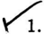

# CamScanner 31-07-2026 10.34.pdf

**Total elements:** 22  

**Tables:** 1  

**Images:** 5  

**Diagrams:** 0  

**Charts detected:** 0  


---

**1. picture**

trar
Re

<!-- grounding: page=1; l=101.1; t=821.3; r=148.7; b=757.7 -->

*Page(s): 1*  

**Media:**  


  


**OCR Text:**
```
trar
Re
```


---

# NED UNIVERSITY OF ENGINEERING & TECHNOLOGY E-Mail:dracad@neduet.edu.pk/Website: www.neduet.edu.pk Phone: (92-21) 99261261-8 Ext-2221/Fax: (92-21) 99261255

<!-- grounding: page=1; l=157.3; t=808.0; r=494.7; b=771.3 -->

*Page(s): 1*  


---

**3. text**

No.Acad/9(H)/53078

<!-- grounding: page=1; l=371.3; t=763.3; r=472.3; b=752.3 -->

*Page(s): 1*  


---

**4. text**

Dated:14-07-2026

<!-- grounding: page=1; l=372.0; t=751.7; r=456.3; b=742.7 -->

*Page(s): 1*  


---

## OFFICE ORDER

<!-- grounding: page=1; l=251.7; t=719.3; r=344.3; b=704.3 -->

*Page(s): 1*  


---

**6. text**

(Computer Science) to the following students of BS Computer Science Programme Bat Sss  S  o  Sss  o os D-6.

<!-- grounding: page=1; l=85.3; t=658.0; r=508.7; b=623.0 -->

*Page(s): 1*  


---

**7. text**

The list of Computer Science (General) one section is attached as Annex-A.

<!-- grounding: page=1; l=117.0; t=611.7; r=506.3; b=596.0 -->

*Page(s): 1*  


---

**8. text**

Whwssain

<!-- grounding: page=1; l=394.0; t=583.0; r=494.0; b=551.0 -->

*Page(s): 1*  


---

**9. picture**

Yhussain
REGISTRAR

<!-- grounding: page=1; l=397.1; t=580.9; r=489.2; b=544.8 -->

*Page(s): 1*  

**Media:**  


  


**OCR Text:**
```
Yhussain
REGISTRAR
```


---

**10. caption**

REGISTRAR

<!-- grounding: page=1; l=407.0; t=554.7; r=470.7; b=543.3 -->

*Page(s): 1*  


---

**11. text**

Copy to:

<!-- grounding: page=1; l=85.7; t=522.7; r=128.3; b=510.0 -->

*Page(s): 1*  


---

**12. picture**

<!-- grounding: page=1; l=104.7; t=505.2; r=129.0; b=485.8 -->

*Page(s): 1*  

**Media:**  


  


---

**13. list_item**

Chairperson, Department of Computer Science & IT

<!-- grounding: page=1; l=113.7; t=497.7; r=381.7; b=484.0 -->

*Page(s): 1*  


---

**14. list_item**

Controller of Examinations

<!-- grounding: page=1; l=117.3; t=478.7; r=265.7; b=467.3 -->

*Page(s): 1*  


---

**15. list_item**

Senior Manager (IS)

<!-- grounding: page=1; l=117.3; t=461.3; r=230.7; b=449.3 -->

*Page(s): 1*  


---

**16. text**

Copy for information to:

<!-- grounding: page=1; l=85.3; t=408.0; r=202.0; b=396.3 -->

*Page(s): 1*  


---

**17. list_item**

Dean (ECE)

<!-- grounding: page=1; l=180.0; t=382.3; r=255.0; b=369.0 -->

*Page(s): 1*  


---

**18. list_item**

CAC

<!-- grounding: page=1; l=177.7; t=355.0; r=233.7; b=339.7 -->

*Page(s): 1*  


---

**19. picture**

<b>CS</b> CamScanner

<!-- grounding: page=1; l=484.5; t=32.5; r=578.3; b=8.6 -->

*Page(s): 1*  

**Media:**  


  


**OCR Text:**
```
<b>CS</b> CamScanner
```


---

## List of Students Batch 2024 - BS Computer Science (General) Section A

<!-- grounding: page=2; l=140.7; t=798.3; r=479.4; b=783.9 -->

*Page(s): 2*  


---

**21. table**

|   S. No. | Roll No           | Name                                        | Allocated Specialisation          |
|----------|-------------------|---------------------------------------------|-----------------------------------|
|        1 | CT-24219          | SYEDA ALIZA AYAZ                            | Computer Science                  |
|        2 | CT-24218          | ARSALA KHAN                                 | Computer Science                  |
|        3 | CT-24028          | MUHAMMAD UMAR                               | Computer Science                  |
|        4 | CT-24053          | SYEDA AMNA JAFRI                            | Computer Science                  |
|        5 | CT-24255          | MUHAMMAD SARAIB                             | Computer Science                  |
|        6 | CT-24009          | TAYYABA                                     | Computer Science                  |
|        7 | CT-24157          | HAMNA ALI KHAN                              | Computer Science                  |
|        8 | CT-24248          | RIDA RAFIQUE                                | Computer Science                  |
|        9 | CT-24185          | HASSAN SHAKIL                               | Computer Science                  |
|       10 | CT-24047          | IZHAN KHAN                                  | Computer Science                  |
|       11 | CT-24169          | AMNA MOHSIN                                 | Computer Science                  |
|       12 | CT-24267          | SHAHZAIM                                    | Computer Science                  |
|       13 | CT-24197          | AYAN MIRZA                                  | Computer Science                  |
|       14 | CT-24309          | AYESHA                                      | Computer Science                  |
|       15 | CT-24280          | MUHAMMAD HUZAIFA                            | Computer Science                  |
|       16 | CT-24201          | FATIMA AZFAR                                | Computer Science                  |
|       17 | CT-24029          | SYED HUZAIFA BUKHARI                        | Computer Science                  |
|       18 | CT-24041          | MUHAMMAD AHMED BASIT KHAN                   | Computer Science                  |
|       19 | CT-24266          | SARIM KHAN                                  | Computer Science                  |
|       20 | CT-24001          | JAVERIA IRFAN ALI                           | Computer Science                  |
|       21 | CT-24236          | MUHAMMAD WASAY RAFIQ                        | Computer Science                  |
|       22 | CT-24204          | HIBA ABRAR                                  | Computer Science                  |
|       23 | CT-24222          | MUHAMMAD BILAL RASHEED                      | Computer Science                  |
|       24 | CT-24042          | ZORAIZ AFRIDI                               | Computer Science                  |
|       25 | CT-24171          | AHMED RAZA                                  | Computer Science                  |
|       26 | CT-24020          | M. IBTISSAM ASLAM                           | Computer Science                  |
|       27 | CT-24048          | SYED AHMED AYAAN                            | Computer Science                  |
|       28 | CT-24225          | NIZAM UDDIN AHMED                           | Computer Science                  |
|       29 | CT-24265          | MUHAMMAD MAAZ ALI                           | Computer Science                  |
|       30 | CT-24075          | MUHAMMAD SUBHAN KHAN                        | Computer Science                  |
|       31 | CT-24308          | RAZA ALI                                    | Computer Science                  |
|       32 | CT-24085          | MUHAMMAD OWAIS KAMRAN KHANIA                | Computer Science                  |
|       33 | CT-24235          | MUHAMMAD SARIM UMER                         | Computer Science                  |
|       34 | CT-24268          | MUHAMMAD DANISH MERAJ                       | Computer Science                  |
|       35 | CT-24245          | MUHAMMAD AHMED KHAN                         | Computer Science                  |
|       36 | CT-24154          | SAMIN                                       | Computer Science                  |
|       37 | CT-24237          | MUHAMMAD HAMZA HAMID                        | Computer Science                  |
|       38 | CT-24045          | AFLAH ARIF                                  | Computer Science                  |
|       39 | CT-24070          | HUSN UR REHMAN KHAN                         | Computer Science                  |
|       40 | CT-24056          | KINZA                                       | Computer Science                  |
|       41 | CT-24238          | MUHAMMAD MESUM ABBAS                        | Computer Science                  |
|       42 | CT-24137          | MUHAMMAD HARIS                              | Computer Science                  |
|       43 | CT-24116          | AMNA SHAIKH                                 | Computer Science                  |
|       44 | CT-24139          | MUHAMMAD ARSAL SAJID                        | Computer Science                  |
|       45 | CT-24247          | MUHAMMAD FERAS MALIK                        | Computer Science                  |
|       46 | CT-24208          | MISHAL KHAN                                 | Computer Science                  |
|       47 | CT-24263          | MUHAMMAD AFZAL                              | Computer Science                  |
|       48 | CT-24239 CT-24177 | MOHAMMAD USMAN MASOOD FUZAIL AHMED SIDDIQUI | Computer Science Computer Science |
|       49 | CT-24281          |                                             |                                   |
|       50 |                   | SYED MUHAMMAD HUNAIN                        | Computer Science                  |

<!-- grounding: page=2; l=105.9; t=785.5; r=512.3; b=135.9 -->

*Page(s): 2*  

**Media:**  

- [Table CSV](/content/output/CamScanner 31-07-2026 10.34/tables/CamScanner 31-07-2026 10.34_table_1_p2.csv) (page 2, 50 rows, 4 cols)  

- [Table HTML](/content/output/CamScanner 31-07-2026 10.34/tables/CamScanner 31-07-2026 10.34_table_1_p2.html)  


---

**22. picture**

<b>CS</b> CamScanner

<!-- grounding: page=2; l=484.7; t=32.2; r=578.3; b=8.6 -->

*Page(s): 2*  

**Media:**  


  


**OCR Text:**
```
<b>CS</b> CamScanner
```


---
