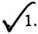

# CamScanner 31-07-2026 10.37.pdf

**Total elements:** 20  

**Tables:** 1  

**Images:** 5  

**Diagrams:** 0  

**Charts detected:** 0  


---

**1. picture**

tra
ır
Re

<!-- grounding: page=1; l=103.0; t=818.0; r=151.0; b=754.2 -->

*Page(s): 1*  

**Media:**  


  


**OCR Text:**
```
tra
ır
Re
```


---

# NED UNIVERSITY OF ENGINEERING & TECHNOLOGY E-Mail:dracad@neduet.edu.pk/Website: www.neduet.edu.pk Phone: (92-21) 99261261-8 Ext-2221/Fax: (92-21) 99261255

<!-- grounding: page=1; l=158.0; t=806.0; r=490.0; b=768.3 -->

*Page(s): 1*  


---

**3. text**

No. Acad/9(H)/53087 Dated:14-07-2026

<!-- grounding: page=1; l=368.0; t=760.7; r=467.0; b=740.3 -->

*Page(s): 1*  


---

## OFFICE ORDER

<!-- grounding: page=1; l=251.7; t=715.0; r=342.0; b=701.0 -->

*Page(s): 1*  


---

**5. text**

The University Administration has assigned specialization in (Cyber Security) to the following students of BS Computer Science Programme Batch-2024 who are now progressing to the 3rd year (Fall Semester 2026).

<!-- grounding: page=1; l=89.7; t=677.3; r=503.3; b=625.0 -->

*Page(s): 1*  


---

**6. text**

The list of Computer Science (Cyber Security) one section is attached as Annex-E.

<!-- grounding: page=1; l=90.0; t=610.0; r=502.0; b=578.0 -->

*Page(s): 1*  


---

**7. text**

Whaussain

<!-- grounding: page=1; l=390.0; t=572.0; r=490.0; b=532.3 -->

*Page(s): 1*  


---

**8. picture**

Offersain

<!-- grounding: page=1; l=393.1; t=567.2; r=483.7; b=537.3 -->

*Page(s): 1*  

**Media:**  


  


**OCR Text:**
```
Offersain
```


---

**9. caption**

REGISTRAR

<!-- grounding: page=1; l=403.3; t=536.0; r=465.0; b=526.3 -->

*Page(s): 1*  


---

**10. text**

Copy to:

<!-- grounding: page=1; l=89.3; t=502.0; r=131.7; b=489.0 -->

*Page(s): 1*  


---

**11. picture**

<!-- grounding: page=1; l=107.5; t=482.4; r=131.9; b=461.2 -->

*Page(s): 1*  

**Media:**  


  


---

**12. list_item**

Controller of Examinations

<!-- grounding: page=1; l=121.7; t=458.0; r=265.3; b=447.3 -->

*Page(s): 1*  


---

**13. list_item**

Senior Manager (IS)

<!-- grounding: page=1; l=121.3; t=441.0; r=232.0; b=429.7 -->

*Page(s): 1*  


---

**14. text**

Copy for information to:

<!-- grounding: page=1; l=89.7; t=387.0; r=204.0; b=376.0 -->

*Page(s): 1*  


---

**15. list_item**

I, Dean (ECE)

<!-- grounding: page=1; l=178.0; t=362.3; r=255.3; b=349.7 -->

*Page(s): 1*  


---

**16. list_item**

CAC

<!-- grounding: page=1; l=176.0; t=331.7; r=236.3; b=316.7 -->

*Page(s): 1*  


---

**17. picture**

<b>CS</b> CamScanner

<!-- grounding: page=1; l=484.5; t=32.5; r=578.2; b=8.6 -->

*Page(s): 1*  

**Media:**  


  


**OCR Text:**
```
<b>CS</b> CamScanner
```


---

# List of Students Batch 2024 - BS Computer Science (Specialisation: Cyber Security) Section E

<!-- grounding: page=2; l=177.0; t=807.9; r=418.9; b=775.9 -->

*Page(s): 2*  


---

**19. table**

| S. No.   | Roll No           | Name                           | Allocated Specialisation      |
|----------|-------------------|--------------------------------|-------------------------------|
| 1        | CT-24019          | AMMARAH FAROOQI                | Cyber Security                |
| 2        | CT-24269          | WASIF AHMED SOOMRO             | Cyber Security                |
| 3        | CT-24017          | SYEDA LUBABA BATOOL            | Cyber Security                |
| 4        | CT-24081          | DABEER ABBAS RAO               | Cyber Security                |
| 5        | CT-24312          | MUHAMMAD TALHA BIN SUHAIL      | Cyber Security                |
| 6        | CT-24008          | ESHAL AAMIR ALI BASARIA        | Cyber Security                |
| 7        | CT-24061          | GHAZIA SHAH                    | Cyber Security                |
| 8        | CT-24261          | MUSTAFA AHMED SIDDIQUI         | Cyber Security                |
| 9        | CT-24144          | MUHAMMAD IBRAHIM               | Cyber Security                |
| 10       | CT-24145          | MUHAMMAD DANIYAL AKBAR         | Cyber Security                |
| 11       | CT-24113          | AYESHA ASGHAR                  | Cyber Security                |
| 12       | CT-24142          | SAAD ULLAH KHAN                | Cyber Security                |
| 13       | CT-24046          | SYED ABDUL RAFAY               | Cyber Security                |
| 14       | CT-24165          | KHADIJA                        | Cyber Security                |
| 15       | CT-24202          | SYEDA MASOOMA ABIDI            | Cyber Security                |
| 16       | CT-24022          | HAMMAD AHMED SIDDIQUI          | Cyber Security                |
| 17       | CT-24138          | MUHAMMAD RAZA                  | Cyber Security                |
| 18       | CT-24125          | HARIS ZAMIR                    | Cyber Security                |
| 19       | CT-24220          | MAAZ SHAHID                    | Cyber Security                |
| 20       | CT-24124          | SYED TALAL BIN RIZWAN          | Cyber Security                |
| 21       | CT-24043          | SYED MUHAMMAD SHAYAN BIN AMIR  | Cyber Security                |
| 22       | CT-24100          | MUHAMMAD MOSID KHAN            | Cyber Security                |
| 23       | CT-24090          | MUHAMMAD FOUZAN ABDUL AZIZ     | Cyber Security                |
| 24       | CT-24044          | SAIF UR REHMAN                 | Cyber Security                |
| 25       | CT-24092          | ALI JAN                        | Cyber Security                |
| 26       | CT-24212          | MUNEEBAH NADEEM                | Cyber Security                |
| 27       | CT-24136          | ALI HASSAN                     | Cyber Security                |
| 28       | CT-24295          | MUHAMMAD FURQAN ALI            | Cyber Security                |
| 29       | CT-24230          | ABDUL HADI                     | Cyber Security                |
| 30       | CT-24183          | SYED FARISS FAHEEM             | Cyber Security                |
| 31       | CT-24033          | MUHAMMAD HAMZA SIDDIQUI        | Cyber Security                |
| 32       | CT-24232          | SYED MAAZ ALI                  | Cyber Security                |
| 33       | CT-24287          | MUHAMMAD MAHAD HASHMI          | Cyber Security                |
| 34       | CT-24211          | SYEDA JUWERIA KAMRAN           | Cyber Security                |
| 35       | CT-24120          | SYEDA JAWARIA KAZMI            | Cyber Security                |
| 36       | CT-24163          | NAVERA SHAHID HUSSAIN          | Cyber Security                |
| 37       | CT-24088          | ABDUL RAHIM                    | Cyber Security                |
| 38       | CT-24091          | MUHAMMAD SAQIB ASGHAR          | Cyber Security                |
| 39       | CT-24189          | EBRAHIM AATIR GUDARO           | Cyber Security                |
| 40       | CT-24278          | MUHAMMAD SAAD                  | Cyber Security                |
| 41       | CT-24006          | UBAIRA                         | Cyber Security                |
| 42       | CT-24112          | MASARRAT FATEMA                | Cyber Security                |
| 43       | CT-24249          | SYED MUHAMMAD ABUZAR ZAIDI     | Cyber Security                |
| 44       | CT-24098          | AYESHA RAUF                    | Cyber Security                |
| 45       | CT-24191          | ALI IMRAN                      | Cyber Security                |
| 46       | CT-24300          | MUHAMMAD ZAID KHAN             | Cyber Security                |
| 47       | CT-24289          | SYED IBRAHIM AZIZ              | Cyber Security                |
| 48 49    | CT-24107 CT-24217 | TEHZEEB GHAZI SYEDA AMNA ZAHID | Cyber Security Cyber Security |
| 50       | CT-24101          | MAHNOOR HAMID                  | Cyber Security                |

<!-- grounding: page=2; l=111.8; t=776.4; r=483.7; b=116.5 -->

*Page(s): 2*  

**Media:**  

- [Table CSV](/content/output/CamScanner 31-07-2026 10.37/tables/CamScanner 31-07-2026 10.37_table_1_p2.csv) (page 2, 49 rows, 4 cols)  

- [Table HTML](/content/output/CamScanner 31-07-2026 10.37/tables/CamScanner 31-07-2026 10.37_table_1_p2.html)  


---

**20. picture**

<b>CS</b> CamScanner

<!-- grounding: page=2; l=484.9; t=32.1; r=578.4; b=8.7 -->

*Page(s): 2*  

**Media:**  


  


**OCR Text:**
```
<b>CS</b> CamScanner
```


---
